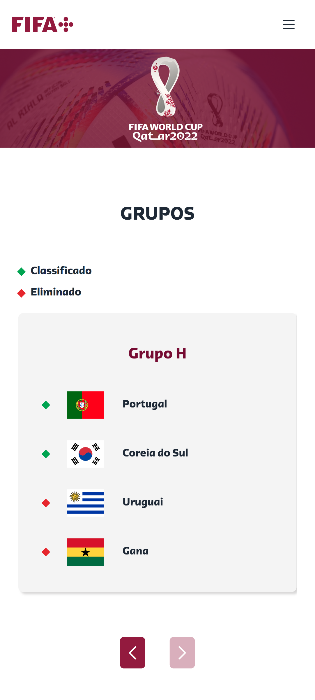
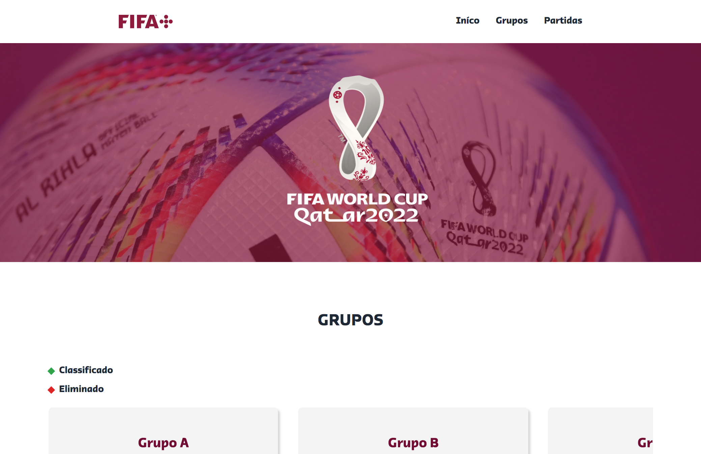

<h2 align="center" >COPA DO MUNDO - TABELA&JOGOS </h2>

  

    

  

### SOBRE:
- Projeto que exibe tabela de classificados e resultados das partidas. 
- Adaptado para todas as telas com os breakpoints do Tailwind.
### TECNOLOGIAS:

- TAILWIND
- JAVASCRIPT
- SWIPER JS

   

### Contato:
 
<a href="paulopariz01@gmail.com">paulopariz01@gmail.com</a>
 
<a href="https://www.linkedin.com/in/paulopariz/">Paulo Pariz</a>

